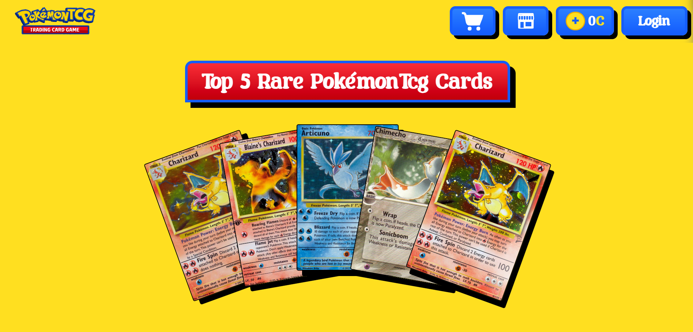

# PokemonTCG Dashboard & Marketplace

A full-stack Pokemon trading card application built with Next.js for the frontend and Go/Gin for the backend. Aplikasi ini mendukung registrasi, verifikasi OTP email, login manual dan Google OAuth, serta fitur dashboard koleksi kartu dengan pembelian menggunakan koin.

## Fitur Utama

### Autentikasi & Profil

- Registrasi akun dengan email dan password.
- Verifikasi akun melalui OTP yang dikirimkan ke email.
- Login manual email/password.
- Login Google OAuth.
- Token JWT disimpan di `localStorage` dan cookie untuk mendukung akses frontend dan middleware.
- Dashboard profile menampilkan nama, email, bio, dan avatar pengguna.
- Logout membersihkan session user, token, cookie, dan cache klien.

### Dashboard Pengguna

- Halaman dashboard menampilkan koleksi kartu Pokemon milik pengguna.
- Komponen detail kartu menampilkan informasi kartu dan harga.
- Pesan fallback ditampilkan jika koleksi kosong.
- Profile card menampilkan status pengguna secara ringkas.

### Marketplace & Checkout

- Marketplace menampilkan showcase kartu Pokemon.
- Checkout kartu menggunakan saldo koin pengguna.
- Backend memperbarui saldo koin dan menambahkan kartu ke koleksi setelah pembelian.
- Pesan error ramah ketika koin tidak cukup atau keranjang kosong.

### Top-Up Koin & Pembayaran

- Dukungan top-up koin melalui Midtrans sandbox.
- Endpoint backend membuat Snap token untuk Midtrans.
- Webhook Midtrans memproses status pembayaran seperti `capture`, `settlement`, `deny`, `expire`, dan `cancel`.
- Koin otomatis ditambahkan ke akun user saat pembayaran berhasil.

### Backend & Data

- Backend API dibuat dengan Go dan framework Gin.
- Database MongoDB menyimpan data user, OTP, kartu, dan transaksi.
- Middleware autentikasi memvalidasi token JWT sebelum akses ke route dashboard dan marketplace.
- Struktur API mencakup route register, verify, login, logout, dashboard, marketplace, dan payment.

## Struktur Proyek

### Frontend

- `app/` — Next.js App Router.
- `app/(auth)/auth/` — halaman login, register, verifikasi OTP, dan sukses.
- `app/(dashboard)/dashboard/` — halaman dashboard dan komponen terkait.
- `components/` — komponen UI global.
- `src/` — context, services, hooks, util, tipe, dan konfigurasi.

### Backend

- `server/` — backend Go.
- `server/config/` — konfigurasi database, OAuth, dan Midtrans.
- `server/controllers/` — logika API endpoint.
- `server/middleware/` — middleware autentikasi.
- `server/routes/` — routing API.
- `server/models/` — model data untuk MongoDB.

## Instalasi & Jalankan Lokal

1. Install dependency frontend:

```bash
npm install
```

2. Jalankan frontend:

```bash
npm run dev
```

3. Siapkan backend Go sesuai environment variables.
4. Jalankan backend Go dengan konfigurasi yang sesuai.

## Environment Variables Backend

Pastikan backend mengatur env berikut:

- `JWT_SECRET`
- `FRONTEND_URL`
- `MONGODB_URI`
- `MONGODB_DB_NAME`
- `GMAIL_USER`
- `GMAIL_APP_PASSWORD`
- `MIDTRANS_SERVER_KEY`
- `NODE_ENV`

## Catatan

README ini dibuat untuk menjelaskan fitur aplikasi dan struktur utamanya. Untuk detail implementasi, lihat file di `server/controllers` dan `app/(dashboard)`.
